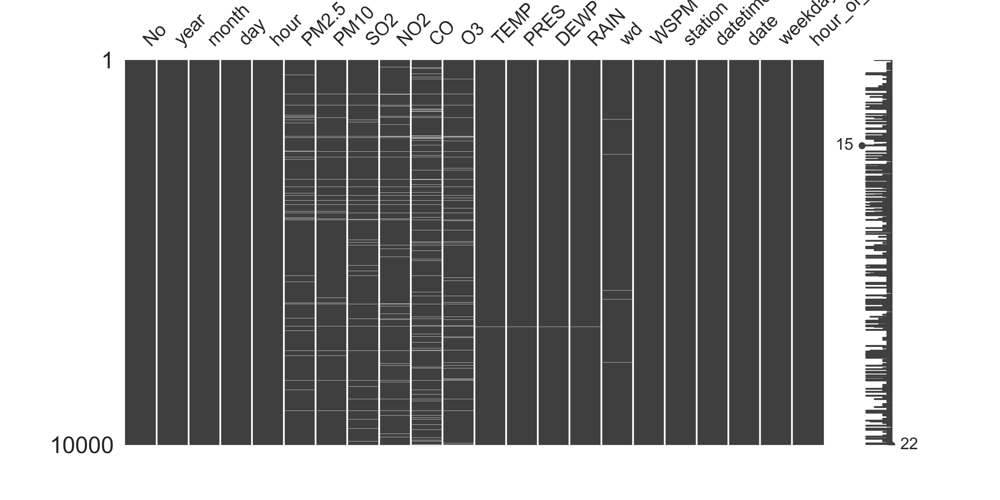
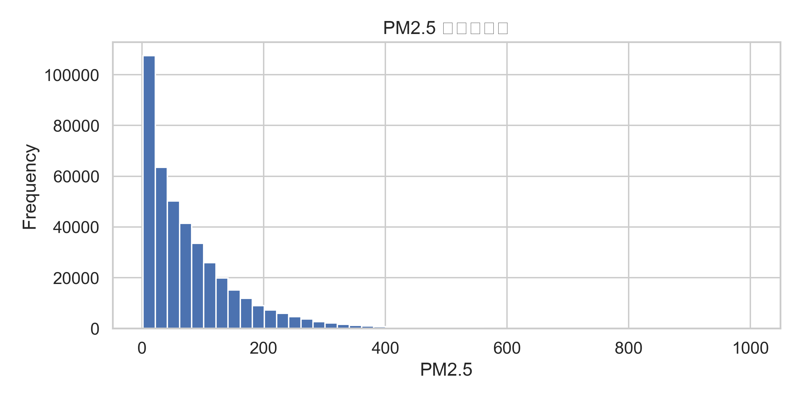
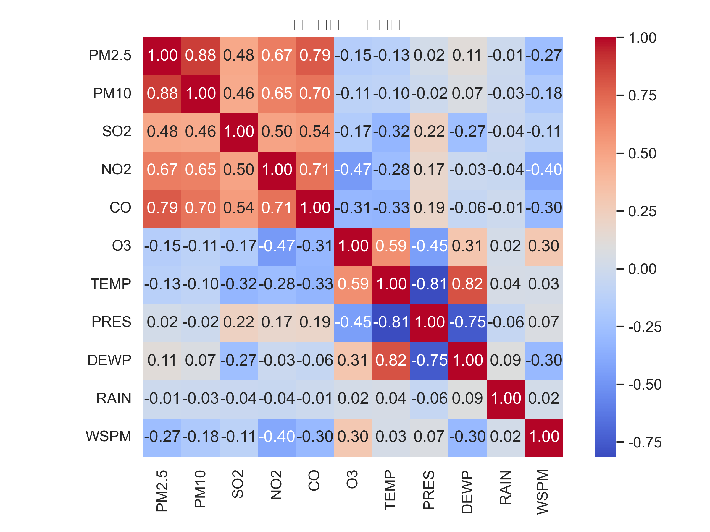

# Beijing Multi-Site Air Quality Visualization

This project uses **Python** to perform data preprocessing and visualization on the **Beijing Multi-Site Air-Quality Data Set**. It includes:

- Basic data overview (`head()`, `info()`, `describe()`)
- Missing data visualization (`missingno.matrix`)
- Distribution histograms of pollutants
- Time series line plots (daily mean PM2.5 for a selected station)
- Monthly boxplots of PM2.5
- Correlation heatmap of key pollutants and meteorological variables

---

## 1. Dataset Description

- **Source**: Kaggle public dataset  
  **Beijing Multi-Site Air-Quality Data Set**
- **Content**: Air quality and meteorological data from multiple monitoring stations in Beijing  
  - Pollutants: `PM2.5`, `PM10`, `SO2`, `NO2`, `CO`, `O3`, etc.  
  - Meteorological variables: `TEMP`, `PRES`, `DEWP`, `RAIN`, `WSPM`, etc.  
  - Time fields: `year`, `month`, `day`, `hour`, etc.  
- The script in this project will:
  - Read all CSV files inside the compressed dataset
  - Merge them into a single DataFrame
  - Create time-related features: `datetime`, `date`, `weekday`, `hour_of_day`

> ⚠️ Please make sure the dataset file is named  
> **`Beijing Multi-Site Air-Quality Data Set.zip`**  
> and placed in the same directory as the Python script.

---

## 2. Project Structure

Main files and their purposes:

- `beijing_air_quality_analysis.py`  
  Main analysis script:
  - Loads and merges all station CSV files from the zip
  - Performs basic preprocessing
  - Generates multiple visualization figures into the `figures/` folder

- `Beijing Multi-Site Air-Quality Data Set.zip` (optional to upload to GitHub)  
  - Original air quality dataset (compressed)
  - The script will automatically read data from this file

- `requirements.txt`  
  - Python package dependencies required to run the script and notebooks

- `figures/` (automatically generated after running the script)  
  Example files:
  - `missing_matrix.png`: missing data visualization
  - `PM2.5_hist.png`: PM2.5 distribution histogram
  - `PM25_timeseries_Aotizhongxin.png`: daily mean PM2.5 time series at Aotizhongxin station
  - `PM25_boxplot_month_Aotizhongxin.png`: monthly PM2.5 boxplots at Aotizhongxin station
  - `correlation_heatmap.png`: correlation heatmap of main variables

---

## Example Figures

### Missing Data Visualization

### PM2.5 Distribution Histogram

### Correlation Heatmap

